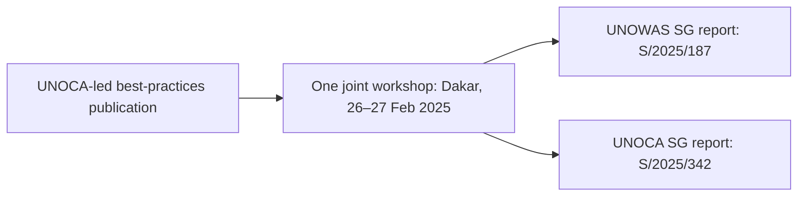

# Retrospective 2025–2026 peace-operations overlap and reuse audit

**Evidence release:** 8 October 2026 · **Scope:** deliberately selected public UN records, not a complete census · **Financial evidence:** no separately paid duplicate service verified.

## Decision summary

**Several functions were already delivered jointly in 2025–2026.** These should be viewed as examples of **existing coordination or demonstrated shared production**, rather than opportunities to merge two duplicate activities. Strong cases include UNOWAS–UNOCA joint field work and workshops, UNRCCA–UNAMA shared training, and jointly issued DPPA–DPO guidance/briefings. Other activities share topics or source information but have **legally distinct final audiences, regions or operational qualifications**.

The retrospective dataset now contains **42 public source records**, **38 canonical activity/output records** (37 with 2025–2026 activity dates and one explicitly excluded October 2024 workshop documented in 2025), **36 adjudicated evidence comparisons**, and links from the actual records to **19 of the 32 planned 2027 output categories**. The remaining **13 of 32 are unmatched in this selected source sample**, **not shown to have no work or no potential overlap**. Of all 36 matches, **none establishes the unique cost of a separately paid duplicate activity**. Consequently incremental net savings remain **not estimated**, not zero.

### Four parallel areas

| Comparison | 2025–2026 matching investigations | 2027 output categories with at least one supporting retrospective case | Central result |
|---|---:|---:|---|
| UNOWAS–UNOCA | 14 | 6/8 | Joint Nigeria field mission and Dakar workshop already delivered; separate mandated reports and SC briefings remain |
| UNAMA–UNRCCA | 8 | 6/8 | Shared academy and climate capacity-building; participation in forums does not imply co-organization |
| DPPA–DPO regional desks | 7 | 3/8 | Existing joint strategic review, Mission Concept guidance and integrated regional briefings; no two separately funded versions demonstrated |
| Training comparisons | 7 | 4/8 | Similar climate and OSINT/AI subject areas, but distinct cohorts, policing qualifications and organizing institutions |
| **Selected sample total** | **36** | **19 of 32** | **0 verified duplicate paid services** |

**Interpretation warning:** These figures count *adjudicated case relationships* and *covered 2027 output categories*, not a random sample of UN activities. They **cannot** be converted to prevalence estimates or extrapolated to budgets.

## 1. Confirmed existing joint work — reusable models, not new cuts

### UNOWAS–UNOCA: shared mission and forum, January 2025

An official UNOWAS [mission account](https://unowas.unmissions.org/en/news/unoca-and-unowas-renew-their-joint-commitment-to-support-stabilization-and) identifies a **single joint 27–31 January 2025 trip to Nigeria** by the regional Special Representatives. They also attended the **29–31 January Fifth Lake Chad Basin Governors' Forum**, nested inside the same travel window. The separate UNOWAS and UNOCA [SG reports S/2025/187](https://documents.un.org/api/symbol/access?l=en&s=S%2F2025%2F187&t=pdf) and [S/2025/342](https://unoca.unmissions.org/sites/default/files/2025-12/28th_sg_report_on_the_situation_in_central_africa_and_the_activities_of_the_unoca.pdf) both describe these events.

**Defensible reuse:** one shared original itinerary, event ID, stakeholder log and where permissible shared travel procurement. **Not established:** two duplicated field visits; the forum as an additional five-day mission; or duplicated paid travel costs. Evidence: **EV001–EV002; MX001–MX002**.

### UNOWAS–UNOCA: joint workshop reused as separate reporting input, February 2025

[UNOWAS's event notice](https://unowas.unmissions.org/en/news/west-and-central-africa-unowas-and-unoca-pool-their-efforts-to-strengthen-peaceful) and both official reports identify **one 26–27 February 2025 Dakar workshop on farmer–herder relations and transhumance**. UNOCA also compiled a best-practice reference launched at that event. The **same workshop appears in two separate SG reports** (S/2025/187; S/2025/342).

**Defensible reuse:** a single event master record, participant/action registry, shared fact sheet and publication distribution. **Distinct deliverables to preserve:** the two region-specific Council reports and the UNOCA-led best-practices publication. Evidence: **EV003–EV004, EV010–EV011; MX003–MX004, MX010**.

### UNRCCA–UNAMA: shared training sessions, April 2025 and February 2026

The [22 April 2025 UNRCCA Preventive Diplomacy Academy](https://unrcca.unmissions.org/en/news/unrccas-preventive-diplomacy-academy-explores-legacy-un-and-role-political-missions) was hosted by UNRCCA in cooperation with UNAMA, with contributors from both. The [17–19 February 2026 Ashgabat climate/security workshop](https://unrcca.unmissions.org/en/news/unrcca-co-organizes-workshop-strengthening-climate-security-and-peacebuilding) was **organized by DPPA (for the Climate Security Mechanism) and UNSSC**, in cooperation with UNRCCA and UNAMA; it brought together **30 participants**.

**Defensible reuse:** shared course materials, speakers and event administration, coupled with clear organizer/host/attendee responsibilities. **Not established:** two independently paid versions of either workshop or **DPO independently co-organizing** the February 2026 event. Evidence: **EV018, EV020; MX015–MX016**.

### DPPA–DPO: pre-existing joint policy and Council products

DPPA and DPO jointly undertook the [27 May 2025 General Assembly consultation](https://dppa.un.org/en/node/101187) leading toward the [Secretary-General's peace operations review A/80/798–S/2026/600](https://www.un.org/un80-initiative/en/all-un80-related-resources-and-documents). They also co-endorsed the **2025 Mission Concept and Mission Plan guidance** with DOS. Regional Assistant Secretaries-General delivered **individual** 2025–2026 Council briefings publicly attributed to the shared DPPA–DPO structure (Haiti, Ukraine and Palestine).

**Defensible reuse:** a controlled **single-source policy/guidance register**, joint briefing production tracker and one canonical Council event ID per actual appearance. **Not established:** that separate DPPA and DPO teams invoiced separately for the same product or that already joint structures warrant a second merger. Evidence: **EV026–EV032; MX023–MX028**.

### How a shared event can support two legally distinct reports

**The reusable object is the documented event and its underlying evidence**, not the distinct Secretary-General reporting mandates. The diagram depicts *documented references and distribution*, not quantified editorial time or costs.

## 2. Shared input ≠ redundant final deliverable

### Separate UNOWAS and UNOCA reports

- **S/2025/187** (UNOWAS) and **S/2025/342** (UNOCA) refer to the same Dakar event but have different reporting jurisdictions and document symbols. Their common factual source could be reused, while each mandated SG report remains.
- **S/2025/771** and **S/2025/772** were issued on **28 November 2025**, but are different regional reports despite their coincident date.
- **S/2026/445** (UNOCA) and **S/2026/537** (UNOWAS) similarly remain different 2026 SG reports.
- On **11 December 2025**, UNOCA briefed the Security Council under **S/PV.10060**; on **18 December**, UNOWAS briefed under **S/PV.10073**. These are **two actual Council meetings**, not duplicated administrative counts.

**Permissible conclusion:** investigate shared transregional research packets and common issue metadata, not elimination of prescribed Council reports. Evidence: **MX010–MX014** and official UN Council report/meeting identifiers.

### UNAMA–UNRCCA: shared regional discussions, different substantive functions

[UNRCCA's 27–28 November 2025 Central Asia deputy ministers meeting](https://unrcca.unmissions.org/en/news/unrcca-convenes-fifteenth-annual-meeting-deputy-foreign-ministers-central-asian-states) included an **UNAMA participant**, but UNAMA was **not identified as a joint host**. A [15 June 2026 regional envoy forum](https://unrcca.unmissions.org/en/news/srsg-kaha-imnadze-participates-in-the-eighth-meeting-of-special-representatives-and) was hosted by Kazakhstan and included both UN presences. UNAMA's SG Afghanistan reports **S/2025/789** and **S/2026/99** are country-focused mandatory outputs, not duplicates of regional meetings.

**Permissible conclusion:** shared Afghanistan-related risk input and a regional briefing template may improve preparation; evidence does not support eliminating UNAMA country reporting, Afghan women consultation, or UNRCCA regional good offices. Attendance and hosting are different roles. Evidence: **MX017–MX022**.

## 3. Training: possible common content, distinct cohort and mandate

**21–22 July 2025 Tashkent** and **24–25 July 2025 Astana** UNRCCA/UNOCT training on OSINT, AI and counterterrorism early warning covered similar methods but had **different dates, locations and national cohorts**. This is a plausible **curriculum and trainer-pool standardization** candidate, not a duplicated event or a redundant audience. Sources: [Tashkent](https://unrcca.unmissions.org/en/news/unrcca-co-organizes-second-training-central-asia-enhancing-counter-terrorism-early) and [Astana](https://unrcca.unmissions.org/en/news/unrcca-co-organizes-third-training-central-asia-enhancing-counter-terrorism-early).

DPPA's [2–5 December 2025 E-Analytics course](https://www.un.org/en/node/238185) involved a staff attendee from a DPPA–DPO shared team, but was organized by **DPPA and QCRI**, not by DPO. A UNMISS/UNPOL climate-security policing syllabus and DPPA-PBSO/UNSSC peacebuilding programming workshops share broad subject matter but train **different professional functions**. Common open-source data, glossary or procurement may be reusable; policing tactics, security rules, and mediation instruction are not interchangeable.

One important **temporal negative control**: an UNOCA/DPPA/DPO/UNSSC **October 2024** workshop generated a practice note **published April 2025**. The **event must not be added to 2025 training counts** merely because its documentation appeared in 2025. Evidence: **MX029–MX036, EV038**.

## 4. Ranked evidence-based reuse work packages

The [11-case reuse decision register](../data/retrospective_2025_2026_reuse_decisions.csv) prioritizes observable coordination and potential shared procurement:
1. **One joint field-trip/event identity**, beginning with UNOWAS–UNOCA Nigeria.
2. **One workshop/source record reused across regional reports**, beginning with February 2025 Dakar.
3. **DPPA/DPO common policy guidance and final report control**, avoiding duplicate counting of one joint document.
4. **Single integrated Council briefing production record** for joint regional leadership.
5. **Shared UNRCCA/UNAMA training materials and event administration**, while preserving attendee and host roles.
6. **Common transregional analytic input tracker**, without consolidating separate mandatory reports.
7. **Potential reused training modules** across OSINT/AI cohorts, subject to course-level content comparisons.

The other entries cover important non-consolidation controls: UNAMA's independent Afghanistan outputs, distinct Council briefings, specialist policing versus diplomacy instruction, and correct event-year classification.

**Recommended first administrative deliverable:** an **event–source–output graph** with immutable canonical IDs: a source event links to participant teams, shared factual packets, cost objects (only when later authorized), and multiple distinct required outputs. This would improve coordination while maintaining traceable legal ownership. The existing 2025–2026 case identifiers make this reproducible without access to confidential accounts.

## 5. Test methodology and evidence limitations

The audit matches, in order: (i) authoritative **document symbol or Council meeting number**, (ii) event **date and place**, (iii) named **organizer, host, contributor and attendee role**, (iv) output type and intended audience, and (v) precise evidence that materials or a deliverable were actually shared. Common keywords, dates or geographical issues alone do **not** establish identity.

**Two complementary levels** are required:
- **Observed cooperation / source reuse:** one joint event, report citation or jointly issued product is independently supported by public records.
- **Verified financial duplication / net savings:** two distinct charges for an interchangeable service, avoided replacement cost, actual implementation and continuing mandate outcomes. This higher level remains **unverified** in every case.

This is a **purposive sample**, not a population-wide automated scrape of all 2025–2026 records. It does **not** estimate a duplication rate. Some official search results expose report metadata without every paragraph; the [source manifest](../data/retrospective_2025_2026_sources.csv) records where only an index, selected searchable section or an official news account could be reviewed. Records from 2026 later than the review date are outside scope. Monetary duplicate costs and new net savings remain **not estimated**, not zero.

## 6. Reproduce and extend

| Dataset | Coverage | Use |
|---|---:|---|
| [Official public source catalogue](../data/retrospective_2025_2026_sources.csv) | 42 | UN source URLs, exact cited symbol or event, interpretation limits |
| [Canonical event/output register](../data/retrospective_2025_2026_activities.csv) | 38 | Event/publication identities and organizer/participant distinctions |
| [Adjudicated match ledger](../data/retrospective_2025_2026_matches.csv) | 36 | Pairing, classification, canonical IDs, evidence and cost-verification gate |
| [2027 proposed output crosswalk with retrospective links](../data/public_deliverable_crosswalk_2027.csv) | 32 | Compare 2027 planned output categories to selected actual 2025–2026 findings |
| [Four-group coverage summary](../data/retrospective_2025_2026_summary.csv) | 4 | Descriptive coverage, no inferential denominator |
| [Reuse decision cases](../data/retrospective_2025_2026_reuse_decisions.csv) | 11 | Prioritized administrative tests, existing reuse and mandate exclusions |

Run \`python3 scripts/validate_retrospective_matches.py\` to check identifiers, 2024 exclusion, 2025–2026 boundaries, classification integrity, all 32 2027 planned categories, source URLs, and the prohibition on fabricated incremental savings. The base-R renderer can create a compact retrospective board from these public records.

**Release verdict:** Published material supports **existing joint activities and reusable inputs**, but **zero independently established separately charged duplicate services** and **no monetized incremental savings**. This is **not an assertion that true duplicate spending is zero**.
